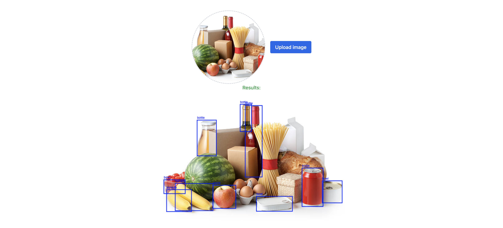
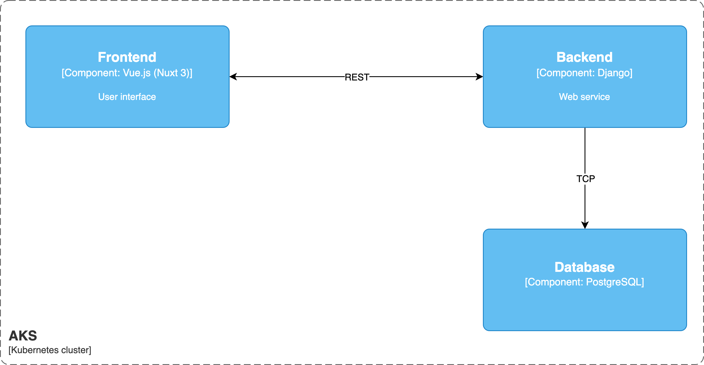
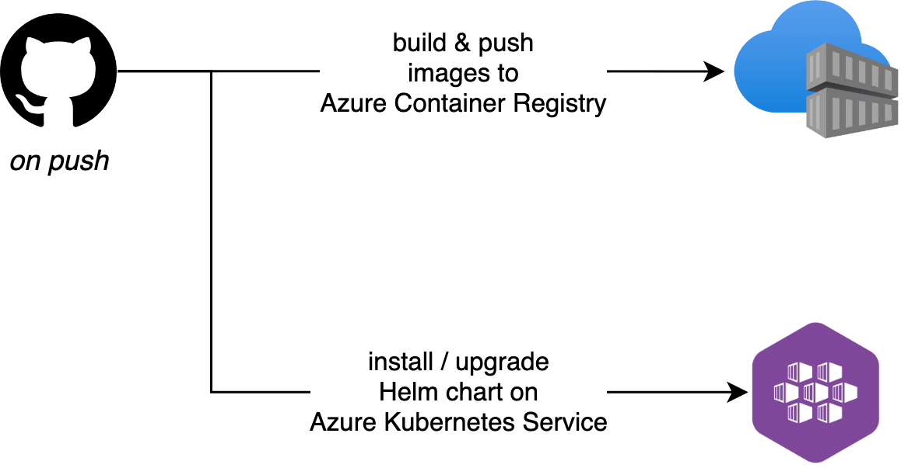

# Produce Finder - a project using Vue.js, Django, Azure, Ansible, Docker and Kubernetes
This is a simple application that, upon uploading an image with groceries, will:
1. Store the detected items in a database, adding up quantities of the same item.
2. Update external systems (e.g. an Excel sheet, Notion board etc.).
3. Return the original image, with bounding boxes overlayed, to the user.

## Architecture
For now the architecture is kept simple:
1. A frontend written in Vue.js, interacting, over HTTP with a
2. Backend written in Python (Django)*, which in turns saves detection results in a
3. PostgreSQL database.

> :warning: **Object detection models:**: At the moment, only the YOLOv8 and YOLOv9 model architectures are supported. More coming soon.

## Deployment
The application is meant to be deployed with:
1. [Docker compose](/docker-compose.yml) for development / testing.
2. Helm + Kubernetes in production.

## CICD

# TODO
- [ ] Add auth (OAuth2 w/ Keycloak)
- [ ] Add `upload model` (weights) feature.
- [ ] Add `select model` feature.
- [ ] Write Helm Chart
- [ ] Create K8s namespace
- [ ] Create K8s imagePullSecret
- [ ] Expose with Azure Application Gateway
- [ ] Write Ansible Playbook to:
    - [ ] Deploy Azure Container Registry
    - [ ] Create Service Principal
    - [ ] Deploy Azure Kubernetes Service
    - [ ] Prepare K8s namespace
    - [ ] Install Helm chart
- [ ] Trace requests w/ OpenTelemetry
- [ ] Integrate with Google Sheets (inventory)
- [ ] Integrate with Notion (inventory)
